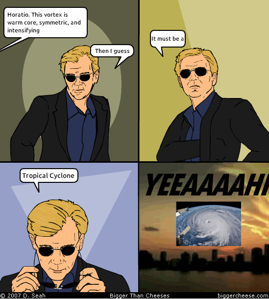

# WCSI - Warm Core, Symmetric, and Intensifying
A set of criteria for identifying tropical cyclones from a set of cyclone tracks



This repository contains a pip installable command line script and python function for applying the WCSI criteria to a set of cyclone tracks.
Also included are a set of scripts and functions to reproduce the analysis and figures from the paper describing the method (to be submitted).

## Install
```bash
git clone https://github.com/Huracan-project/wcsi.git
cd wcsi
pip install .
```

## Applying WCSI criteria
### Command line script
To apply the WCSI criteria to your tracks, you can run the command line script
```bash
wcsi filename_in filename_out
```
where `filename_in` is the name of a file that can be loaded with [`huracanpy.load`](https://huracanpy.readthedocs.io/en/stable/user_guide/load.html)

This will create two files
- filename_out.nc - The subset of tracks that are WCSI, with an `is_tc` variable added that marks the WCSI points
- filename_out.parquet - A summary table of all the input tracks showing which track IDs were identified as WCSI or not

Various different filters and thresholds can be applied. Run
```bash
wcsi --help
```
To see the full set of options

Note that the script assumes you have certain named variables in your file
- The cyclone phase space parameters named as `cps_b`, `cps_vtl`, `cps_vtu`
- `relative_vorticity` with `pressure` as a vertical coordinate

If you want to rename variables without creating a new file, you can use the python function instead

### Python function
To apply the WCSI criteria to tracks using the python function you can follow the example below
```python
import huracanpy
from wcsi import nature

# Load tracks with huracanpy
tracks = huracanpy.load("filename_in")

# Apply WCSI criteria
wcsi_tracks, summary = nature.wcsi(tracks)

# Save the tracks and summary table
huracanpy.save(wcsi_tracks, "filename_out.nc")
summary.to_parquet("filename_out.parquet")
```
As with the command line script, various different filters and thresholds can be applied. Run
```python
from wcsi import nature

help(nature.wcsi)
```
to see the function documentation.

## Paper
This repository contains all the code needed to reproduce the results in the paper.
To do that, first download the ERA5 and JRA3Q tracks, and the summary table from [zenodo](https://zenodo.org/records/19825153).
To produce these files I have already run
```bash
# Apply WCSI criteria to ERA5 and JRA3Q tracks
wcsi ERA5_all.nc ERA5_WCS --intensification_threshold=None
wcsi ERA5_WCS.nc ERA5_WCSI
wcsi JRA3Q_nolat-tcident.nc JRA3Q_nolat-tcident_WCSI

# Create table summary tracks by filter and matching across datasets
python -m wcsi.scripts.add_nature
# Add a nature tag to the ERA5 tracks
python -m wcsi.scripts.combine_summaries
```

Then, to recreate the figures in the paper
1. Download and subset IBTrACS (`wcsi.scripts.ibtracs_subset`)
2. Create a file with MSLP at maximum intensity matched across different datasets (`wcsi.scripts.matched_lmi`)
3. Run the scripts in `wcsi.plot`
